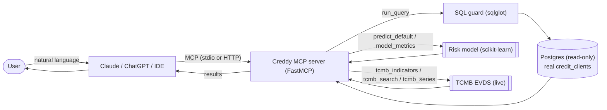

# Creddy

> A [Model Context Protocol](https://modelcontextprotocol.io) server that turns natural
> language into **safe SQL over real, labeled credit data**, serves an **interpretable
> default-risk model**, and pulls **live data from Turkey's Central Bank (TCMB)** — all
> through Claude, ChatGPT, or any MCP client.

Built as a portfolio piece for an **AI Engineering** role at a BNPL fintech. It exercises
the exact skills such roles ask for: **SQL + Python**, designing an **A.I. system from the
ground up**, working with **real, labeled data**, model **evaluation**, and fluency with
**Claude / MCP** tooling.

```text
You:    "Eğitim düzeyine göre temerrüt oranı nedir?"
Claude: → inspects the schema, writes SQL, runs it read-only, answers.

You:    "35 yaşında, limiti 20.000, eylülde 2 ay gecikmesi olan müşteri batar mı?"
Claude: → %58 — YÜKSEK risk. En etkili faktör: eylül gecikmesi.

You:    "Güncel dolar, euro ve altın fiyatları nedir?"
Claude: → live values straight from TCMB.
```

## Highlights

- **Real data, real labels.** 30,000 real anonymized clients (UCI) with a real default
  label — not synthetic.
- **Trained risk model.** Logistic-regression scorer (AUC ≈ 0.71, KS ≈ 0.37) with
  **signed, per-decision explanations** — explainable, adverse-action friendly.
- **Two-layer SQL safety.** `sqlglot` parser (SELECT-only, single statement, row cap) **and**
  a read-only DB session — model-generated SQL is never trusted blindly.
- **Live Turkey data.** Headline indicators + key-authenticated catalog search from TCMB EVDS.
- **Runs anywhere.** stdio for local clients, **Streamable HTTP** for remote clients and hosting.
- **Tested.** 24 unit tests + a 12-case SQL eval harness, all green.

## Architecture



## Real data sources

| Source | What | Where it lives | Access |
| --- | --- | --- | --- |
| **UCI Credit Default** | 30,000 real clients, real repayment history, **real default label** (~22%) | Postgres (`credit_clients`) | Free, no key ([UCI #350](https://archive.ics.uci.edu/dataset/350/default+of+credit+card+clients)) |
| **TCMB EVDS** | **Live** Turkish indicators: USD/EUR, gold, deposit & loan rates, reserves, M3, inflation | Fetched live | No key for indicators; free key for catalog search |

> The UCI set is credit-card data (Taiwan, 2005), not Turkish BNPL — but the task is
> identical: *repayment behaviour → default prediction*. The Turkey angle is live from TCMB.

---

## Quick start (local)

Prerequisites: **Python 3.10+** and **Docker**.

```powershell
# 1. Start Postgres
docker compose up -d

# 2. Virtual environment + install
python -m venv .venv
.\.venv\Scripts\Activate.ps1
pip install -e ".[dev]"

# 3. Configure (defaults already match docker-compose)
Copy-Item .env.example .env
#    tcmb_indicators needs no key; add a TCMB key for tcmb_search/tcmb_series

# 4. One-shot: schema + real data + trained model
creddy setup

# 5. Verify
python eval/run_eval.py
pytest
```

On macOS/Linux use `source .venv/bin/activate` and `cp .env.example .env`.

---

## Connect it to a client

### Local clients (stdio)

These launch the server as a subprocess — no hosting required. Use the **full path** to
your virtual-env Python.

<details open>
<summary><b>Claude Desktop</b></summary>

Edit `claude_desktop_config.json` (Settings → Developer → Edit Config; on Windows it is at
`%APPDATA%\Claude\claude_desktop_config.json`):

```json
{
  "mcpServers": {
    "creddy": {
      "command": "C:\\Users\\you\\payMCP\\.venv\\Scripts\\python.exe",
      "args": ["-m", "creddy", "serve"],
      "env": {
        "CREDDY_DB_HOST": "localhost",
        "CREDDY_DB_PORT": "5432",
        "CREDDY_DB_NAME": "creddy",
        "CREDDY_DB_USER": "creddy",
        "CREDDY_DB_PASSWORD": "creddy",
        "CREDDY_TCMB_API_KEY": ""
      }
    }
  }
}
```

Restart Claude Desktop; the tools appear under the connectors/tools menu.
</details>

<details>
<summary><b>VS Code (GitHub Copilot, Agent mode)</b></summary>

Create `.vscode/mcp.json` in the workspace:

```json
{
  "servers": {
    "creddy": {
      "type": "stdio",
      "command": "C:\\Users\\you\\payMCP\\.venv\\Scripts\\python.exe",
      "args": ["-m", "creddy", "serve"]
    }
  }
}
```

Then open Chat → Agent mode → select the tools.
</details>

<details>
<summary><b>Cursor</b></summary>

Create `.cursor/mcp.json` (project) or `~/.cursor/mcp.json` (global):

```json
{
  "mcpServers": {
    "creddy": {
      "command": "C:\\Users\\you\\payMCP\\.venv\\Scripts\\python.exe",
      "args": ["-m", "creddy", "serve"]
    }
  }
}
```
</details>

### Remote clients (HTTP URL)

`claude.ai` (web) and **ChatGPT** can't launch a local process — they connect to a
**public HTTPS URL** that speaks Streamable HTTP. First expose the server over HTTP
(see [Run over HTTP](#run-over-http)), then:

- **claude.ai** → Settings → **Connectors** → *Add custom connector* → paste `https://<your-host>/mcp`
  (requires a Pro/Max/Team/Enterprise plan).
- **ChatGPT** → Settings → **Connectors** (developer mode) → add an MCP server with URL
  `https://<your-host>/mcp` (availability depends on your plan).

> Menu names move around between releases — see the
> [Claude](https://support.anthropic.com) / [OpenAI](https://platform.openai.com/docs) docs
> for the current path. The URL format (`…/mcp`) is what matters.

---

## Run over HTTP

```powershell
creddy serve --http --host 0.0.0.0 --port 8000
# -> Streamable HTTP endpoint at http://localhost:8000/mcp
```

Need a public HTTPS URL to test a remote client quickly? Tunnel it:

```powershell
# Cloudflare (no account needed for quick tunnels)
cloudflared tunnel --url http://localhost:8000
# or: ngrok http 8000
```

Use the printed HTTPS URL with `/mcp` appended as the connector URL.

---

## Deploy / publish

To use the server from claude.ai or ChatGPT permanently, host the container and point it
at a managed Postgres.

### 1. A managed Postgres (free)

Create a free serverless Postgres on **[Neon](https://neon.tech)** or
**[Supabase](https://supabase.com)** and note the host / db / user / password.

### 2. Hugging Face Spaces (Docker)

1. Create a new **Space** → **Docker** SDK, and push this repo (it already has a
   [`Dockerfile`](Dockerfile) and [`docker-entrypoint.sh`](docker-entrypoint.sh)).
2. Put this front-matter at the top of the Space's `README.md`:

   ```yaml
   ---
   title: Creddy
   emoji: 📊
   colorFrom: indigo
   colorTo: blue
   sdk: docker
   app_port: 7860
   ---
   ```
3. In **Settings → Variables and secrets**, add your DB (and optional TCMB key):

   ```text
   CREDDY_DB_HOST, CREDDY_DB_PORT, CREDDY_DB_NAME, CREDDY_DB_USER, CREDDY_DB_PASSWORD
   CREDDY_DB_SSLMODE=require   (Neon / Supabase require SSL)
   CREDDY_TCMB_API_KEY         (optional)
   ```

On first boot the container runs `creddy setup` (schema + real data + model training, a few
seconds) and then serves at:

```text
https://<your-username>-<space-name>.hf.space/mcp
```

Use that URL as the connector in claude.ai / ChatGPT.

> The same image runs on **Render**, **Fly.io** or **Railway** — point the service at your
> managed Postgres and expose port `7860`.

### 3. Keep it awake for free (optional)

Free Spaces sleep after inactivity. A scheduled ping keeps the Space (and a Neon DB) warm so
the link is responsive when someone opens it — no paid server required. This repo ships a
GitHub Actions workflow ([`.github/workflows/keepalive.yml`](.github/workflows/keepalive.yml))
that sends a real MCP `initialize` every 30 minutes and fails if the endpoint is down (so it
doubles as an uptime check).

Setup: push the repo to GitHub, then add a repository secret
`MCP_URL = https://<user>-<space>.hf.space/mcp` (Settings → Secrets and variables → Actions).

Caveats (be honest with yourself): GitHub's scheduled runs can be delayed and are
auto-disabled after ~60 days of no repo commits; on a cold rebuild the container re-runs
`creddy setup` (~10–20 s). It's perfect for a demo, not a production SLA. Alternatives:
[UptimeRobot](https://uptimerobot.com) or [cron-job.org](https://cron-job.org) (both free)
pinging the same URL.

---

## Tools

| Tool | Purpose |
| --- | --- |
| `list_tables` | List database tables |
| `describe_schema` | Columns + types, to ground SQL generation |
| `run_query` | Validate + execute a read-only `SELECT` over `credit_clients` |
| `predict_default` | Predict a client's default probability + top risk factors |
| `model_metrics` | The trained model's AUC / precision / recall and key drivers |
| `tcmb_indicators` | **Live** headline Turkish indicators (USD, EUR, gold, rates, ...) — no key |
| `tcmb_search` | Search the EVDS catalog for series by name (key-authenticated) |
| `tcmb_series` | Specific EVDS time series via the public REST API (key + current endpoint) |
| `example_questions` | Suggested questions |

## CLI

```text
creddy init-db                 # create schema (drops existing table)
creddy load-data [--limit N]   # fetch + load the real UCI dataset
creddy train-model             # train the default-risk model
creddy setup                   # all three of the above, in one shot
creddy serve [--http]          # run the MCP server (stdio, or Streamable HTTP)
            [--host H --port P]
```

## Risk model

`creddy train-model` trains an interpretable logistic-regression pipeline (standardize
numerics + one-hot encode categoricals) on the real `credit_clients` data with an 80/20
train/test split. It reports **AUC, accuracy, precision, recall, F1 and KS**, picks the
decision threshold with **Youden's J**, and saves the model to `models/`.

Every `predict_default` call returns the probability, a risk band, and the **signed top
factors** behind that specific decision. Current hold-out performance: **AUC ≈ 0.71**,
KS ≈ 0.37; a low-risk profile scores ~12% and a high-risk profile ~58% (base rate ≈ 22%),
so the scores are meaningful, not just rankings.

## Data model (`credit_clients`)

Monetary columns are in **NT$**; `pay_*` are repayment-status codes per month
(`-1/0` = paid duly, `>=1` = months of delay); `defaulted` is the label.

```text
client_id, credit_limit, sex, education, marriage, age,
pay_sep..pay_apr,          -- repayment status (6 months)
bill_sep..bill_apr,        -- bill statement amounts
pay_amt_sep..pay_amt_apr,  -- amounts paid
defaulted                  -- TRUE = defaulted next month
```

## Project layout

```text
sql/schema.sql              # Postgres DDL for the real data
src/creddy/
  config.py                 # env-based settings (DB + TCMB)
  db.py                     # psycopg3 read-only connections
  sql_guard.py              # SELECT-only safety layer (sqlglot)
  data_loader.py            # loads the real UCI dataset (ucimlrepo)
  risk_model.py             # trains + serves the default-risk model (scikit-learn)
  tcmb.py                   # live TCMB EVDS client
  server.py                 # FastMCP server + tools
  cli.py                    # init-db / load-data / train-model / setup / serve
eval/                       # golden SQL + evaluation harness
tests/                      # unit tests (no DB / no network required)
Dockerfile, docker-entrypoint.sh   # container image for hosting
```

## Design decisions

- **Real, labeled data over synthetic.** Labels come from the source, so the risk story is genuine.
- **Interpretable model on purpose.** Signed per-decision factors (explainable scoring) over a marginally higher AUC.
- **Guard before LLM trust.** AST inspection blocks DML/DDL, statement stacking and `COPY`/`SET`; the DB session is independently read-only.
- **Eval as a first-class artifact.** `eval/` turns "does the SQL layer work?" into a measurable, CI-friendly pass rate.

## Security

- Read-only `SELECT` only, enforced at two layers (parser + DB session); per-query row cap.
- Secrets (DB password, TCMB key) come from the environment, never hard-coded.
- The UCI data is public and anonymized — no real PII.
- For production, run the MCP under a dedicated Postgres role with `GRANT SELECT` only.

## Honest note on `tcmb_series`

TCMB is migrating EVDS2 → EVDS3. The live `tcmb_indicators` and key-authenticated
`tcmb_search` tools work today; the documented key-based public REST service that
`tcmb_series` targets is currently offline behind that migration. Set
`CREDDY_TCMB_BASE_URL` to the current endpoint once it is republished.

## License

MIT.
